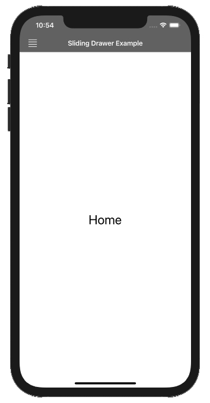
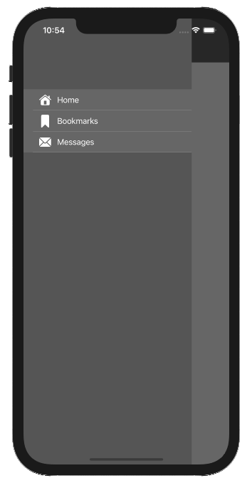

### Sliding Menu iOS

Sliding Menu is often used in mobile applications.
The characteristics of use of this type of window are as follows:

- The sliding window can appear from the left or the right of a screen.
- The sliding window can be displayed partially on top of the previous window or can partially shift this window.

This is an example of Sliding Menu on iOS/Swift:

 
